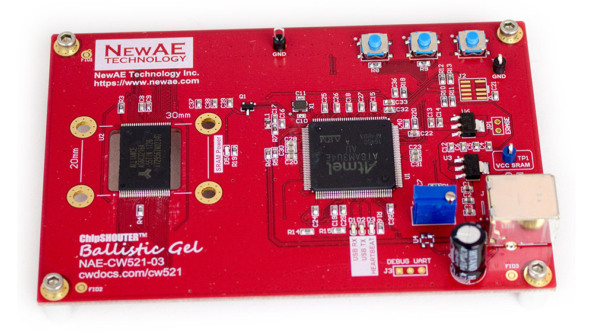

# ChipSHOUTER® CW521 Ballistic Gel

The CW521 is an Electro-Magnetic Fault Injection (EMFI) target. It is specially designed to help you understand fault injection patterns for a given tip.

It uses a large SRAM chip as a target, which has a relatively simple layout. This lets you understand how much of a given chip you are corrupting.



## GIT Layout ##

The GIT repository contains the following:

1) PCB source (Altium) + gerber files
2) Firmware for the microcontroller.
3) Python library / PC application.

## PC Application ##

The PC application is a simple example of using the Python library. This application does the following (via the library)

1. Downloads a pattern to the SRAM chip.
2. Waits for fault injection.
3. Uploads SRAM chip contents & determines corrupt locations.
4. Graphs map of physical SRAM locations (NB: not yet fully working).

The SRAM pattern can be something besides the random pattern, but the random pattern ensures "odd" corruptions (such as shorting address lines etc) will easily be caught.

An example of using the file is given at the end of ballisticgel.py, see the following:

	cw521 = CW521()
    cw521.con()
    
    doplot = False
    savefile = None
    #savefile = 'error_locations.bin' 
    
    #Raw method recommended - same speed and more flexible
    use_raw_method = True

    while True:
        try:        
            if use_raw_method:
                print "Writing data..."
                cw521.raw_test_setup()
                raw_input("Hit enter when glitch inserted")
                results = cw521.raw_test_compare()
            else:
                print "Writing data..."
                cw521.seed_test_setup()
                raw_input("Hit enter when glitch inserted")
                results = cw521.seed_test_compare()
            
            errdatay = results['errdatay']
            errdatax = results['errdatax']
            errorlist = results['errorlist']
            
            if doplot:
                plt.plot(errdatax, errdatay, '.r')
                plt.axis([0, 8192, 0, 4096])
                plt.show()

            if savefile:
                with open(savefile, "wb") as errfile:
                    errfile.write(bytearray(errorlist))
        except:
            cw521.close()

The "graph" that pops up afterwards is slightly bogus - the physical map of the SRAM is not yet accurate. But the most interesting aspect is that you can see number of bit flips (positive/negative), and total number of bytes corrupted.

### Result Format ###

The result information is provided in a dictionary. Depending if you use the fast (but less detailed) method or the slow (but more detailed) method you may not have all of these fields. It currently provides you with this:

 - 'errorlist': A list of addresses of each byte error. The length of this is the number of byte errors.
 - 'errdatax', 'errdatay': errdatax & errdatay attempt to provide a map of locations on SRAM chip where errors occurred. Until mapping is complete this is not fully accurate.
 - 'set_errors': Number of bit-set errors that occurred. Note number of bit errors is different from number of byte errors.
 - 'reset_errors': Number of bit-reset errors that occurred. Note number of bit errors is different from number of byte errors.

## Building Firmware ##

The firmware uses the ChipWhisperer capture build system (naeusb). Navigate to
`firmware/cw521` and run `git submodule update --init naeusb`. Once this has completed,
run `make`.

The firmware build requires `make` and `arm-none-eabi-gcc`.

## Drivers ##

As of commit f62ccdf0ea2d611deabf48ec3ad5db759205dbb0 and firmware version 2.0.0, 
the CW521 now uses the same WCID driver assignment as ChipWhisperer devices,
meaning no custom drivers need to be installed.

If you have old firmware/drivers and want to update, instructions
can be adapted from [ChipWhisperer's documentation on the subject](https://chipwhisperer.readthedocs.io/en/latest/drivers.html)

Note that the same `upgrade_firmware()` method is now available on the CW521 object:

```python
from ballisticgel import CW521
cw521 = CW521()
cw521.upgrade_firmware()
```

## Legal ##

Ballistic Gel is part of the ChipSHOUTER project (which is itself related to the ChipWhisperer project). It is also known as the CW521 target board.

Ballistic Gel is an open-source project, and is released with the GPL license. Assembled boards can be purchased from NewAE Technology Inc at https://store.newae.com .

ChipSHOUTER is a registered trademark of NewAE Technoloy Inc. Note you CANNOT sell boards using the ChipSHOUTER name without permission, and you cannot use NewAE Technology Inc's USB VID on your own products as the USB-IF license disallows sub-licensing in this manner. If you change the VID/PID, simply change the associated VID/PID in the .inf (driver) file as needed.
